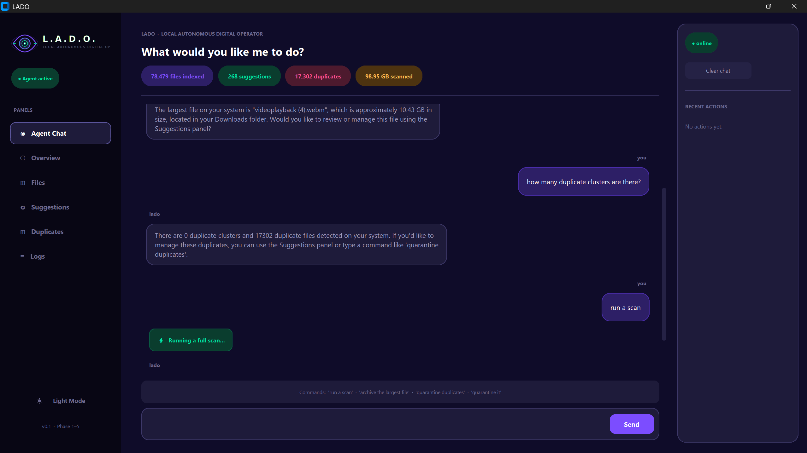
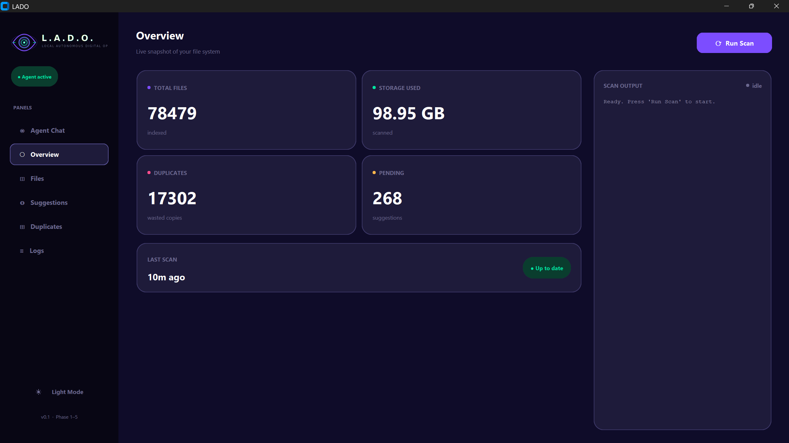
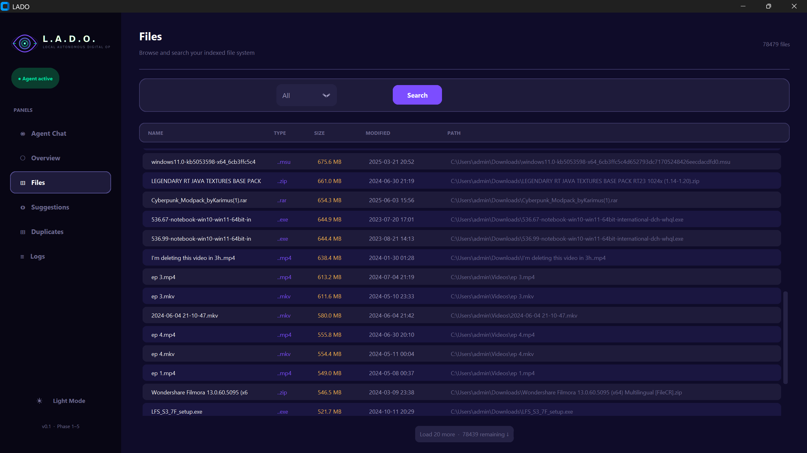
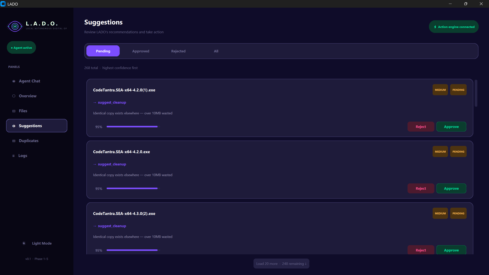
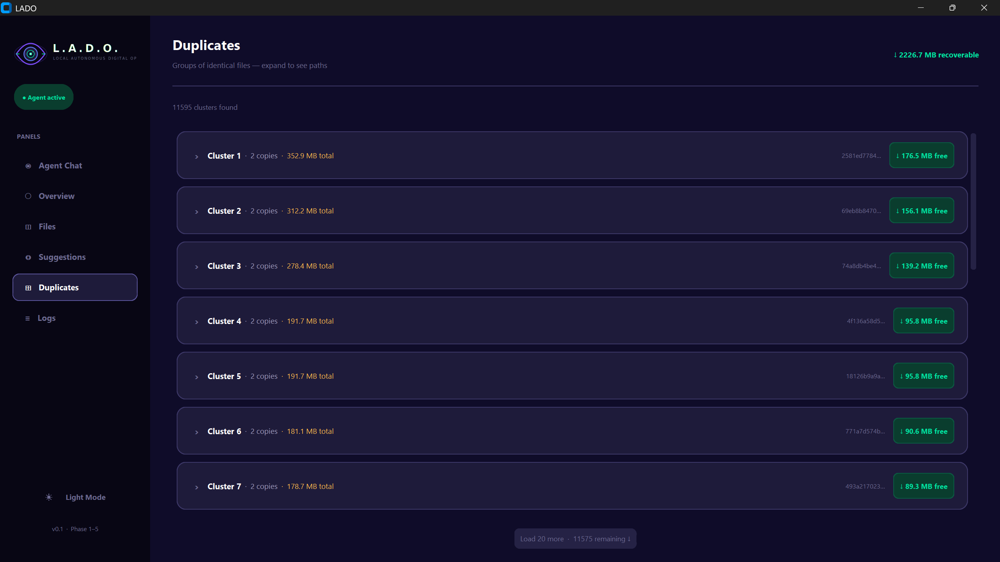
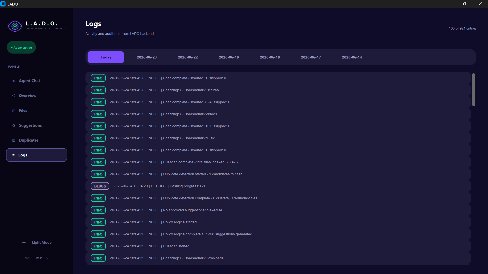

<div align="center">
  
  <h1>LADO</h1>
  <p><strong>Local Autonomous Digital Operator</strong></p>
  <p>An agentic desktop assistant for intelligent file organization, real-time monitoring, and natural language file management.</p>
</div>

---

## Overview

LADO (Local Autonomous Digital Operator) is a local-first, AI-driven desktop assistant designed to solve file clutter autonomously. Rather than relying on rigid rules or manual sorting, LADO uses a combination of real-time file system monitoring, machine learning feedback loops, and natural language processing to continuously analyze and organize your local storage.

LADO operates directly on your machine, ensuring complete privacy while providing an agentic interface to interact with your data.

## Why LADO Exists

Modern operating systems provide basic file browsers, but managing downloads, identifying duplicates, and organizing project files remains a manual, time-consuming process. 

LADO bridges the gap between passive storage and intelligent management. It exists to transition file management from a reactive chore to a proactive, automated workflow guided by user intent and machine learning.

## Features

- **Agentic File Management**: LADO continuously monitors designated directories, automatically generating cleanup and organization suggestions based on file metadata.
- **Natural Language Chat**: Interact with your file system using plain English. Ask LADO about recent downloads, duplicate files, or storage usage.
- **Reinforcement Learning Loop**: LADO learns from your decisions. By accepting or rejecting its organization suggestions, the system refines its policy engine to better match your workflow.
- **Cryptographic Duplicate Detection**: Identifies exact duplicate files using fast hash-based comparisons and visualizes duplicate clusters.
- **Real-Time Monitoring**: Integrates with the host OS file system events to instantly detect new, modified, or deleted files without requiring manual rescans.
- **Local-First Architecture**: All file parsing, database storage (SQLite), and logic execution occurs locally on the host machine.
- **Dual-Theme Interface**: A premium, responsive desktop UI featuring both Dark and Light modes.

## Interface & Screenshots

<p float="left">
  
  
</p>
<p float="left">
  
  
</p>
<p float="left">
  
  
</p>

## Architecture

LADO is divided into two primary subsystems: the **Core Backend Engine** and the **User Interface**.

### Backend Engine (`core/`)
- **Scanner & Watcher**: Real-time event hooks and recursive directory indexing.
- **Policy Engine**: Generates risk-scored suggestions for redundant or unstructured files.
- **Reinforcement Engine**: Adjusts confidence weights based on explicit user approval/rejection.
- **LLM Layer**: Interfaces with the Groq API to translate natural language into context-aware responses and interface state updates.
- **Database Layer**: SQLite repository managing file metadata, hashes, and historical telemetry.

### User Interface (`ui/`)
- Built entirely on `CustomTkinter` for a hardware-accelerated, modern desktop application feel.
- Features persistent state management, dynamic theme tokens, and multithreaded subprocess execution to prevent GUI locking during intensive disk IO.

## Tech Stack

- **Language**: Python 3.10+
- **GUI Framework**: CustomTkinter
- **Database**: SQLite3
- **File System Monitoring**: Watchdog
- **LLM Integration**: Groq API
- **Packaging**: PyInstaller

## Installation

### Prerequisites
- Python 3.10 or higher installed on your system.
- A valid [Groq API Key](https://console.groq.com/keys) for the natural language agent.

### Setup from Source

1. **Clone the repository**
   ```bash
   git clone https://github.com/NamishRajyaguru/LADO_PROJECT.git
   cd LADO_PROJECT
   ```

2. **Install dependencies**
   ```bash
   pip install -r requirements.txt
   ```

3. **Configure the Environment**
   Create a `.env` file in the root directory and add your Groq API key:
   ```env
   GROQ_API_KEY=your_api_key_here
   ```

4. **Run the Application**
   ```bash
   python ui/app.py
   ```

### Building the Executable (Windows)

To package LADO into a standalone executable:
```bash
pyinstaller app.spec --clean
```
The compiled executable will be available in the `dist/` directory.

## Usage

1. **Configure Targets**: Open `config.py` to add directories you want LADO to monitor (e.g., `Downloads`, `Documents`).
2. **Initial Scan**: Click "Run Scan" on the Dashboard to populate the local database and generate baseline analytics.
3. **Review Suggestions**: Navigate to the Suggestions tab to approve or reject LADO's file management recommendations.
4. **Agent Chat**: Use the Chat tab to ask LADO questions about your file organization and get context-aware answers based on the latest scan.

## Current Status

LADO is currently in **Active Development**. The core architecture, UI framework, database schema, and LLM integrations are fully implemented. The PyInstaller build process is stable for Windows deployments.

## Future Roadmap

- macOS and Linux packaging support.
- Fully automated autonomous actions (allowing LADO to execute high-confidence actions without prompting).
- Multi-agent collaboration for specialized tasks (e.g., dedicated image classification agents).
- Enhanced local memory systems (Vector DB integration for semantic file search).

## Authors

### @NamishRajyaguru
- Project Architecture & Core Logic
- Backend Development & Database Integration
- Agent Design & Reinforcement System

### @NishadRaval
- UI Development & Experience Design
- CustomTkinter Theming & Interface Components

---

## Disclaimer

LADO is designed to assist with file management. However, file deletion and modification actions are permanent. Users should carefully review all suggestions and configurations before approving actions. The authors are not responsible for unintended data loss.
